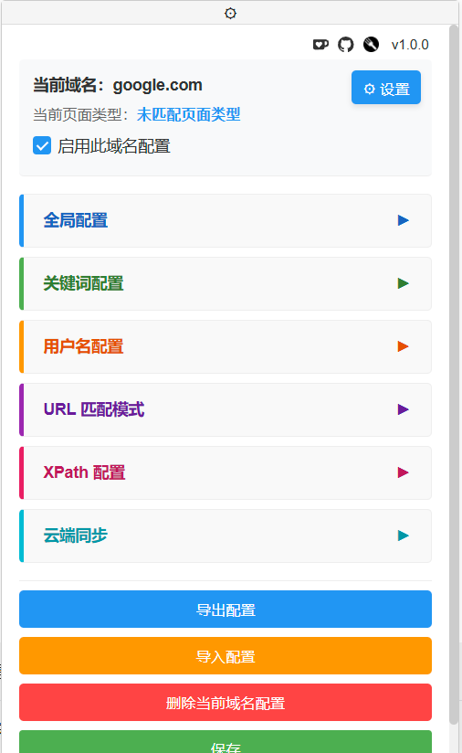

<h3><div align="center">通用论坛屏蔽插件 | Universal Forum Block</div>

---

<div align="center">
  <a href="./README.md">中文</a> |
  <a href="./readme/README_EN.md">English</a>
</div>

## 简介

Universal Forum Block 是一个功能强大的通用论坛内容屏蔽插件。主要功能有：


- 🎯 支持关键词、正则表达式进行精确过滤
- 🚫 支持一键屏蔽用户，不再需要手动复制粘贴
- 🔗 支持全局共享关键字和用户名，实现全网屏蔽
- ☁️ 支持多个云端配置定时同步
- 🔄 支持导入/导出配置
- 🌍 支持多种语言
- 🌐 支持自定义站点配置


## 界面展示：



## 使用示例


## 使用方法

1. 安装脚本管理器（如 Tampermonkey）
2. 点击前往GreasyFork [安装脚本](https://greasyfork.org/scripts/522871-%E9%80%9A%E7%94%A8%E8%AE%BA%E5%9D%9B%E5%B1%8F%E8%94%BD%E6%8F%92%E4%BB%B6)
3. 访问支持的论坛网站
4. 在网站左下角找到我们的面板开始使用

> **特殊说明**：在已配置的论坛中，当鼠标移动到用户名上时会出现屏蔽按钮，点击即可一键屏蔽该用户。屏蔽按钮的显示方式可在设置面板中切换为"总是显示"或"悬停显示"。

## 支持的网站

中文论坛：hostloc，v2ex，nodeseek，linux.do，nodeloc，nga，恩山，3dmgame，百度贴吧，知乎，豆瓣，一亩三分地，巴哈姆特

英文论坛：Lowendtalk, reddit

如果需要支持其他网站，请在[issue](https://github.com/Heavrnl/UniversalForumBlock/issues)中提出或参考[自定义新网站](#自定义新网站)

**除了版本更新外，插件不会自动更新内置的网站配置，可以使用仓库中预设配置导入到全局配置中获取实时更新**

中文论坛:
```
https://raw.githubusercontent.com/Heavrnl/UniversalForumBlock/refs/heads/main/website/chinese/config.json
```

英文论坛:
```
https://raw.githubusercontent.com/Heavrnl/UniversalForumBlock/refs/heads/main/website/english/config.json
```

....

## 界面说明:

#### 全局配置界面

| 配置项 | 说明 |
|--------|------|
| 全局关键字 | 所有已配置的域名共享各自的关键字池 |
| 全局用户名 | 所有已配置的域名共享各自的用户名单 |
| 主页/内容页共享关键词 | 该域名主页和内容页共享关键词池 |
| 主页/内容页共享用户名 | 该域名主页和内容页共享用户名单 |
| 配置连接 | 单向同步一个或多个配置文件的下载，可定时同步，配置模板请看[配置模板说明](#配置模板说明) |

#### 关键词/用户名配置界面

| 配置项 | 说明 |
|--------|------|
| 关键词列表 | 支持正则表达式，输入需要屏蔽的关键词 |
| 用户名列表 | 支持正则表达式，输入需要屏蔽的用户名 |

#### URL匹配模式界面

| 配置项 | 说明 |
|--------|------|
| 主页URL匹配模式 | 该域名主页URL的正则表达式匹配规则 |
| 分页URL匹配模式 | 开发遗留项，可不配置，仅配置主页URL匹配模式即可 |
| 内容页URL匹配模式 | 该域名内容页URL的正则表达式匹配规则 |

#### XPath配置界面

| 配置项 | 说明 |
|--------|------|
| XPath选择器 | 用于定位HTML中的元素位置，分为以下几类：|
| - 主页/分页标题 | 用于匹配主页/分页中的标题文本 |
| - 主页/分页用户 | 用于匹配主页/分页中的用户名 |
| - 内容页关键词 | 用于匹配内容页中的关键词文本 |
| - 内容页用户 | 用于匹配内容页中的用户名 |


## 进阶用法

### 配置模板说明

注：以下模板仅供说明使用，如有需要请使用：[配置模板](./sample_config.json)

```javascript
{
    // 全局配置
    "globalConfig": {
      "GLOBAL_KEYWORDS": false,      // 是否启用全局关键词共享
      "GLOBAL_USERNAMES": false,     // 是否启用全局用户名共享
      "SHOW_BLOCK_BUTTON": "hover",  // 屏蔽按钮显示方式:"hover"悬停显示,"always"总是显示
      "TIME_INTERVAL": 30,           // 配置同步时间间隔(分钟)
      "LANGUAGE": "zh-CN",           // 界面语言
      "GLOBAL_CONFIG_URL": [],       // 全局配置URL列表
      "CONFIG_SECTION_COLLAPSED": {   // 各配置区块的折叠状态
        "global_SECTION_COLLAPSED": true,
        "keywords_SECTION_COLLAPSED": true,
        "usernames_SECTION_COLLAPSED": true,
        "url_SECTION_COLLAPSED": true,
        "xpath_SECTION_COLLAPSED": true
      },
      "EDITOR_STATES": {             // 各配置区块子区块的折叠状态
        "keywords": false,           // 关键词编辑器
        "keywords_regex": false,     // 关键词正则编辑器
        "usernames": false,          // 用户名编辑器
        "usernames_regex": false,    // 用户名正则编辑器
        "mainpage_url_patterns": false,  // 主页URL模式编辑器
        "subpage_url_patterns": false,   // 分页URL模式编辑器
        "contentpage_url_patterns": false, // 内容页URL模式编辑器
        "main_and_sub_page_title_xpath": false,  // 主页和分页标题XPath编辑器
        "main_and_sub_page_user_xpath": false,   // 主页和分页用户XPath编辑器
        "contentpage_title_xpath": false,        // 内容页标题XPath编辑器
        "contentpage_user_xpath": false          // 内容页用户XPath编辑器
      }
    },
    // 用户配置列表
    "userConfig": [
      {
        "domain": "",               // 域名（必填）
        "enabled": true,            // 是否启用
        "mainPageUrlPatterns": [],  // 主页URL匹配模式
        "subPageUrlPatterns": [],   // 分页URL匹配模式
        "contentPageUrlPatterns": [], // 内容页URL匹配模式
        "shareKeywordsAcrossPages": false,  // 是否在主页和分页页面间共享关键词
        "shareUsernamesAcrossPages": true,  // 是否在主页和分页页面间共享用户名
        "mainAndSubPageKeywords": {   // 主页和分页关键词配置
          "xpath": [],                // XPath规则列表
          "keywords": [],             // 关键词列表
          "regexPatterns": []         // 正则表达式列表
        },
        "mainAndSubPageUserKeywords": {  // 主页和分页用户关键词配置
          "xpath": [],
          "keywords": [],
          "regexPatterns": []
        },
        "contentPageKeywords": {         // 内容页关键词配置
          "xpath": [],
          "keywords": [],
          "regexPatterns": []
        },
        "contentPageUserKeywords": {      // 内容页用户关键词配置
          "xpath": [],
          "keywords": [],
          "regexPatterns": []
        }
      }
    ]
  }
```
若配置userConfig了，那么domain是必填项。除了domain，其他全部配置项都是可选

以上配置文件即可用于界面中的导入按钮直接导入，也可以在全局配置的配置连接中导入

若想维护自己的屏蔽词列表，可以这样写

```javascript
{
    "userConfig": [
      {
        "domain": "example.com",               
        "mainAndSubPageKeywords": {   
          "keywords": ["关键词1", "关键词2", "关键词3"],          
        }
      }
    ]
}
```

### 自定义新网站

#### 1. URL匹配模式配置

首先需要分析网站的URL结构,并配置相应的URL匹配模式:

- 主页URL匹配: 如论坛根目录是主页,可填写 `^/$`
- 内容页URL匹配: 如帖子页面URL格式为 `/thread-123456-1.html`,可填写 `^/thread.*`

配置正确后,界面顶部会显示当前页面类型。

#### 2. XPath选择器配置

XPath选择器用于定位页面元素,分为以下几类:

- 主页/分页标题
- 主页/分页用户名
- 内容页关键词
- 内容页用户名

在页面中右键目标元素,点击"检查"找到对应HTML结构，然后找到他的容器标签

例如有以下HTML代码：
```html
<body>
    <li>....</li>
    <li>....</li>
    <li>
        <div>
            <div class="title">标题</div>
            <a username="用户名" class="user"></a>
        </div>
    </li>
</body>
```

我们应该找到 <b>容器标签</b>，这里是`li`，那么他的标题XPath选择器就是 `//li//div[@class="title"]/text()`

若他的用户名在属性里，那么他的用户名XPath选择器就是 `//li//a[@class="user"]/@username`

特殊情况 1 : 假设我们的目标文本在属性里，而且有干扰字符，例如：

```html
<body>
    <li>....</li>
    <li>....</li>
    <li>
        <div>
            <div class="title">标题</div>
            <a username="用户名 2025-01-01 12:00:00" class="user"></a>
        </div>
    </li>
</body>
```

对于这种情况我们的插件自定义了一种新的方法：/split(参数1,参数2,参数3)

- 参数1：分割符，例如空格，逗号，分号等
- 参数2：目标文本的索引，例如1，2，3等，支持负数，-1表示最后一个
- 参数3：目标文本所在属性，例如username

那么他的XPath选择器就是 `//li//a[@class="user"]/split(" ",0,username)`


特殊情况 2 : 假设容器标签下用多个同名的标签，例如：

```html
<body>
    <li>....</li>
    <li>....</li>
    <li>
        <div class="a">
            <li>
                <div class="b">
                    <div class="title">标题</div>
                </div>
            </li>
        </div>
    </li>
</body>
```
如果用原来的`//li//div[@class="title"]/text()`，那么他最终会匹配到`<div class="a">`下面的`li`标签，而不是我们想要的容器标签`li`，

所以要改为`//li//div[@class="a"]//div[@class="title"]/text()`


因此对于我们的XPath选择器：`//容器标签//二级标签/。。。。`
- 容器标签和二级标签之间尽量不要有容易混淆的标签
- 他们两个的距离越近越好


## 捐赠

如果你觉得这个项目对你有帮助，欢迎通过以下方式请我喝杯咖啡：

[](https://ko-fi.com/0heavrnl)

## 开源协议

本项目采用 MIT 开源协议。

你可以自由地使用、修改和分发本项目，但需要保留原始许可证和版权声明。详细信息请参阅 [LICENSE](./LICENSE) 文件。