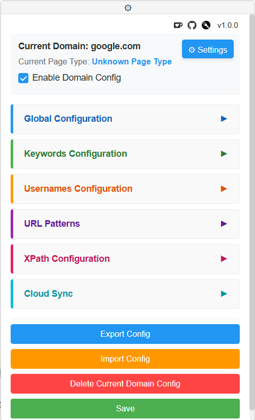
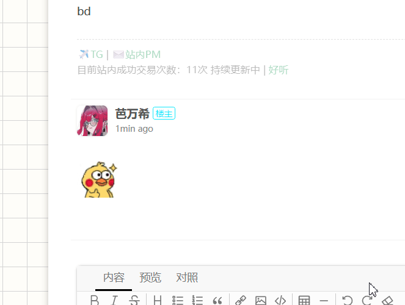

<div align="center">

[][docker-url]

[docker-url]: https://hub.docker.com/r/heavrnl/universalforumblock

</div>

## Introduction

Universal Forum Block is a powerful universal forum content filter. Main features include:

- 🎯 Support for keywords and regular expressions for precise filtering
- 🚫 One-click user blocking, no more manual copy-paste needed
- 🔗 Support for global shared keywords and usernames for network-wide blocking
- ☁️ Support for multiple cloud configuration synchronization
- 🔄 Support for importing/exporting configurations
- 🌍 Support for multiple languages
- 🌐 Support for custom site configuration
- 🐳 Support for docker deployment cloud sync

## Interface Preview:



## Usage Example:




## Usage Guide

### PC:

1. Install a script manager (like Tampermonkey)
2. Click to go to GreasyFork [Install Script](https://greasyfork.org/scripts/522871-%E9%80%9A%E7%94%A8%E8%AE%BA%E5%9D%9B%E5%B1%8F%E8%94%BD%E6%8F%92%E4%BB%B6)
3. Visit supported forum websites
4. Find our panel in the bottom left corner of the website to start using

> **Special note:** On configured forums, when hovering over a username, a block button will appear. Click it to block the user instantly. The display mode of the block button can be switched between "Always Show" or "Show on Hover" in the settings panel.

### Android:
1. Use Microsoft Edge browser, which fully supports Tampermonkey

2. Use AdGuard, go to Settings-Filters-User Scripts-Add User Script, enter
```
https://update.greasyfork.org/scripts/522871/%E9%80%9A%E7%94%A8%E8%AE%BA%E5%9D%9B%E5%B1%8F%E8%94%BD%E6%8F%92%E4%BB%B6.user.js
```

## Supported Websites

Chinese Forums: hostloc, v2ex, nodeseek, linux.do, nodeloc, nga, right.com.cn, 3dmgame, zhihu, douban, baidu tieba, bahamut

English Forums: Lowendtalk, reddit

If you need support for other websites, please raise an [issue](https://github.com/Heavrnl/UniversalForumBlock/issues) or refer to [Custom Website Configuration](#custom-website-configuration)

**Except for version updates, the plugin won't automatically update built-in website configurations. You can import preset configurations from the repository to get real-time updates.**

Chinese Forums:
```
https://raw.githubusercontent.com/Heavrnl/UniversalForumBlock/refs/heads/main/website/chinese/config.json
```

English Forums:
```
https://raw.githubusercontent.com/Heavrnl/UniversalForumBlock/refs/heads/main/website/english/config.json
```

## Sync Server Deployment

After successful deployment, find the admin key in the admin directory and copy it for use.

Docker one-click deployment:
```
docker run -d --name universalforumblock -p 8006:8000 --restart unless-stopped heavrnl/universalforumblock:1.0.0
```

docker-compose:
```yaml
version: '3.8'

services:
  universalforumblock: 
    image: heavrnl/universalforumblock:1.0.0  
    ports:
      - "8006:8000"
    volumes:
      - ./user_configs:/app/user_configs
      - ./admin:/app/admin
    restart: unless-stopped
```

nginx configuration:
```
location / {
        proxy_pass http://127.0.0.1:8006;
        proxy_http_version 1.1;
        proxy_set_header Upgrade $http_upgrade;
        proxy_set_header Connection "Upgrade";
        proxy_set_header Host $host;
    }
```

Create new user:
```
curl -X POST "http://localhost:8006/users/create" -H "X-API-Key: YOUR_ADMIN_KEY"
```

## Interface Description:

#### Global Configuration Interface

| Configuration Item | Description |
|-------------------|-------------|
| Global Keywords | All configured domains share their respective keyword pools |
| Global Usernames | All configured domains share their respective username lists |
| Homepage/Content Page Shared Keywords | Share keyword pool between homepage and content pages for this domain |
| Homepage/Content Page Shared Usernames | Share username list between homepage and content pages for this domain |
| Configuration Links | One-way sync of one or multiple configuration files, can be synchronized periodically, see [Configuration Template Guide](#configuration-template-guide) for template |

#### Keywords/Username Configuration Interface

| Configuration Item | Description |
|-------------------|-------------|
| Keyword List | Supports regular expressions, enter keywords to be blocked |
| Username List | Supports regular expressions, enter usernames to be blocked |

#### URL Pattern Interface

| Configuration Item | Description |
|-------------------|-------------|
| Homepage URL Pattern | Regular expression matching rule for domain homepage URL |
| Pagination URL Pattern | Legacy development item, can be left unconfigured |
| Content Page URL Pattern | Regular expression matching rule for domain content page URL |

#### XPath Configuration Interface

| Configuration Item | Description |
|-------------------|-------------|
| XPath Selector | Used to locate elements in HTML, divided into following categories: |
| - Homepage/Pagination Title | For matching title text in homepage/pagination |
| - Homepage/Pagination User | For matching usernames in homepage/pagination |
| - Content Page Keywords | For matching keyword text in content pages |
| - Content Page User | For matching usernames in content pages |


## Advanced Usage

### Configuration Template Guide

Note: The following template is for illustration only. If needed, please use: [Configuration Template](./sample_config.json)

```javascript
{
    // Global configuration
    "globalConfig": {
      "GLOBAL_KEYWORDS": false,      // Enable global keyword sharing
      "GLOBAL_USERNAMES": false,     // Enable global username sharing
      "SHOW_BLOCK_BUTTON": "hover",  // Block button display mode: "hover" or "always"
      "TIME_INTERVAL": 30,           // Configuration sync interval (minutes)
      "LANGUAGE": "zh-CN",           // Interface language
      "GLOBAL_CONFIG_URL": [],       // Global configuration URL list
      "CONFIG_SECTION_COLLAPSED": {   // Collapse state of config sections
        "global_SECTION_COLLAPSED": true,
        "keywords_SECTION_COLLAPSED": true,
        "usernames_SECTION_COLLAPSED": true,
        "url_SECTION_COLLAPSED": true,
        "xpath_SECTION_COLLAPSED": true
      },
      "EDITOR_STATES": {             // Collapse state of config subsections
        "keywords": false,           // Keywords editor
        "keywords_regex": false,     // Keywords regex editor
        "usernames": false,          // Usernames editor
        "usernames_regex": false,    // Usernames regex editor
        "mainpage_url_patterns": false,  // Main page URL pattern editor
        "subpage_url_patterns": false,   // Sub page URL pattern editor
        "contentpage_url_patterns": false, // Content page URL pattern editor
        "main_and_sub_page_title_xpath": false,  // Main and sub page title XPath editor
        "main_and_sub_page_user_xpath": false,   // Main and sub page user XPath editor
        "contentpage_title_xpath": false,        // Content page title XPath editor
        "contentpage_user_xpath": false          // Content page user XPath editor
      }
    },
    // User configuration list
    "userConfig": [
      {
        "domain": "",               // Domain (required)
        "enabled": true,            // Enable status
        "mainPageUrlPatterns": [],  // Main page URL patterns
        "subPageUrlPatterns": [],   // Sub page URL patterns
        "contentPageUrlPatterns": [], // Content page URL patterns
        "shareKeywordsAcrossPages": false,  // Share keywords across pages
        "shareUsernamesAcrossPages": true,  // Share usernames across pages
        "mainAndSubPageKeywords": {   // Main and sub page keywords config
          "xpath": [],                // XPath rules list
          "keywords": [],             // Keywords list
          "regexPatterns": []         // Regex patterns list
        },
        "mainAndSubPageUserKeywords": {  // Main and sub page user keywords config
          "xpath": [],
          "keywords": [],
          "regexPatterns": []
        },
        "contentPageKeywords": {         // Content page keywords config
          "xpath": [],
          "keywords": [],
          "regexPatterns": []
        },
        "contentPageUserKeywords": {      // Content page user keywords config
          "xpath": [],
          "keywords": [],
          "regexPatterns": []
        }
      }
    ]
}
```
If userConfig is configured, domain is required. All other configuration items are optional.

This configuration file can be imported directly using the import button in the interface or imported in the configuration links in global configuration.

If you want to maintain your own blocked word list, you can write it like this:

```javascript
{
    "userConfig": [
      {
        "domain": "example.com",               
        "mainAndSubPageKeywords": {   
          "keywords": ["keyword1", "keyword2", "keyword3"],          
        }
      }
    ]
}
```

### Custom Website Configuration

#### 1. URL Pattern Configuration

First, analyze the website's URL structure and configure corresponding URL patterns:

- Homepage URL Pattern: If forum root directory is homepage, use `^/$`
- Content Page URL Pattern: If post page URL format is `/thread-123456-1.html`, use `^/thread.*`

When configured correctly, the current page type will be displayed at the top of the interface.

#### 2. XPath Selector Configuration

XPath selectors are used to locate page elements, divided into these categories:

- Homepage/Pagination Title
- Homepage/Pagination Username
- Content Page Keywords
- Content Page Username

Right-click the target element on the page, click "Inspect" to find the corresponding HTML structure, then locate its container tag.

For example, with this HTML code:
```html
<body>
    <li>....</li>
    <li>....</li>
    <li>
        <div>
            <div class="title">Title</div>
            <a username="Username" class="user"></a>
        </div>
    </li>
</body>
```

We should find the <b>container tag</b>, here it's `li`, so its title XPath selector would be `//li//div[@class="title"]/text()`

If the username is in an attribute, its username XPath selector would be `//li//a[@class="user"]/@username`

Special Case 1: If target text is in an attribute with interference characters, for example:

```html
<body>
    <li>....</li>
    <li>....</li>
    <li>
        <div>
            <div class="title">Title</div>
            <a username="Username 2025-01-01 12:00:00" class="user"></a>
        </div>
    </li>
</body>
```

For this case, our plugin has a custom method: /split(param1,param2,param3)

- param1: separator, e.g., space, comma, semicolon
- param2: target text index, e.g., 1,2,3, supports negative numbers, -1 means last
- param3: attribute containing target text, e.g., username

So its XPath selector would be `//li//a[@class="user"]/split(" ",0,username)`

Special Case 2: If there are multiple tags with same name under container tag:

```html
<body>
    <li>....</li>
    <li>....</li>
    <li>
        <div class="a">
            <li>
                <div class="b">
                    <div class="title">Title</div>
                </div>
            </li>
        </div>
    </li>
</body>
```
Using original `//li//div[@class="title"]/text()` would match the `li` tag under `<div class="a">` instead of our desired container `li` tag.

So change it to `//li//div[@class="a"]//div[@class="title"]/text()`

Therefore, for our XPath selectors: `//container_tag//second_level_tag/....`
- Avoid confusing tags between container tag and second level tag
- The closer they are, the better

## Donation

If you find this project helpful, feel free to buy me a coffee:

[](https://ko-fi.com/0heavrnl)

## License

This project is licensed under the MIT License.

You are free to use, modify, and distribute this project, but must retain the original license and copyright notice. See [LICENSE](./LICENSE) file for details.